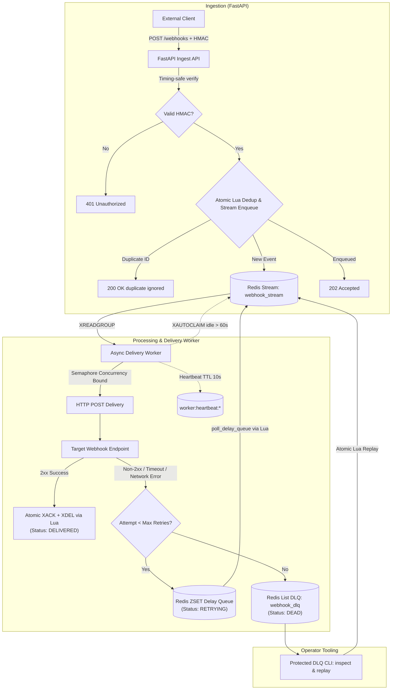

# Webhook Delivery Service

[](https://github.com/vanshch/webhook-delivery-service/actions/workflows/ci.yml)
[](https://python.org)
[](LICENSE)

A resilient webhook ingestion and delivery engine built with **FastAPI**, **Redis Streams**, and async workers. Provides timing-safe HMAC authentication, atomic duplicate suppression, exponential backoff retries with jitter, dead-letter queueing (DLQ), and automatic crashed-worker message reclamation.

---

## Deployment Status & Verification Bar

The deployment target architecture is a dedicated single-host VM on **Oracle Cloud** (x86_64 Ubuntu LTS, 954 MiB RAM, 2 GB swap) behind Caddy with automatic TLS and private TLS Redis.

To distinguish historically verified deployment evidence from current live availability, the service is not claimed as currently live or healthy unless freshly verified. Calling the service currently deployed requires three checks:

1. **Public HTTPS with a broadly trusted certificate** resolving to the deployed endpoint.
2. **/readyz healthy**: Returning HTTP 200 to confirm active Redis connectivity and worker heartbeat.
3. **Fresh end-to-end smoke test**: Successfully executing `scripts/smoke_test.py` to prove signed ingest, delivery, outbound HMAC, duplicate suppression, and retry recovery.

GitHub automated CD is currently disabled and is operational polish rather than a prerequisite for a manual deployment. Deployments are executed and verified manually following [`DEPLOYMENT.md`](DEPLOYMENT.md).

Historical deployment stability was established in a verified 24-hour production soak run (see [Verified 24-Hour Production Soak Evidence](#verified-24-hour-production-soak-evidence)), but historical evidence is kept separate from claims of current availability.

The current deployment at `api.webhookdelivery.dev` passed trusted HTTPS, readiness, and the full end-to-end smoke test on September 16, 2026.

| Resource | Target Endpoint / URL | Description |
|---|---|---|
| **Deployment Base URL** | [https://api.webhookdelivery.dev](https://api.webhookdelivery.dev) | Current public HTTPS API |
| **Interactive Docs** | [https://api.webhookdelivery.dev/docs](https://api.webhookdelivery.dev/docs) | OpenAPI / Swagger UI |
| **Readiness Probe** | [https://api.webhookdelivery.dev/readyz](https://api.webhookdelivery.dev/readyz) | Verifies Redis connectivity & worker heartbeat |
| **Liveness Probe** | [https://api.webhookdelivery.dev/livez](https://api.webhookdelivery.dev/livez) | Process liveness probe |
| **Health Check** | [https://api.webhookdelivery.dev/health](https://api.webhookdelivery.dev/health) | Process status probe |

---

## Architecture



---

## Operational Guarantees & Limitations

### Delivery Semantics: At-Least-Once Delivery
- The engine guarantees **at-least-once delivery**. Messages are acknowledged (`XACK`) and deleted (`XDEL`) from Redis Streams **only after** delivery succeeds, retry state is committed, or the event is moved to the DLQ.
- If a delivery worker crashes or is killed during transit, its pending entry is claimed by a healthy worker via Redis `XAUTOCLAIM` after an idle threshold (default: 60s).
- **Receiver Requirement**: Receiving endpoints **must implement idempotent processing** and deduplicate incoming events using the top-level payload `id` field. Exactly-once delivery across distributed network boundaries cannot be guaranteed.

### Idempotency & Ingestion Deduplication
- Ingestion deduplication is enforced atomically via a Redis Lua script combining `EXISTS`, `XADD`, `SET NX EX`, and initial delivery state creation.
- Configured by `IDEMPOTENCY_TTL_SECONDS` (default: 86,400 seconds / 24 hours). Re-submitting an event ID within this TTL returns `200 OK {"status": "duplicate ignored"}` without re-enqueuing.

### Retries & Dead-Letter Queue (DLQ)
- **Retry Conditions**: Delivery attempts treat every non-2xx HTTP response (including 3xx redirects because HTTP redirect following is disabled, 4xx client errors, and 5xx server errors), delivery-time target validation failures, HTTP timeouts, and network exceptions as failed attempts eligible for retry.
- **Retry Schedule**: Exponential backoff with random jitter (`min(2^attempt + jitter, 60.0)` seconds), stored in a Redis sorted set (`webhook_delay_queue`).
- **Timeout Policy**: Each outbound HTTP attempt has a 5-second client timeout; redirects are not followed.
- **DLQ Routing**: After `MAX_RETRY_ATTEMPTS` (default: 5) consecutive delivery failures, events are moved to the `webhook_dlq` list and marked `DEAD`.
- **Operator Replay**: Dead-lettered events can be inspected and atomically replayed back to the main stream using the protected DLQ CLI.

### Target Validation & SSRF Protection
- Target URLs are validated against private, loopback, multicast, and link-local IP spaces. In production, outbound requests are strictly restricted to hostnames listed in `ALLOWED_TARGET_HOSTS`.

### Known Limitations
- In the historically verified deployment configuration, Redis, the API, and the worker share a single VM; the deployment has persistence and restart policies but no cross-host high availability.
- Concurrent workers do not guarantee that receivers observe events in ingestion order.
- All non-2xx responses are retried, including permanent 4xx responses; exhausted events require DLQ inspection or replay.
- Idempotency claims and delivery-status records expire after `IDEMPOTENCY_TTL_SECONDS` (24 hours by default).
- The committed soak artifact is an audited summary. Raw per-cycle and host-sample logs remain on the deployment VM and are not included in this repository.

---

## Execution Sequences

### 1. Happy Path (Success)
1. **Client Request**: Client sends `POST /webhooks` with body and `x-signature: sha256=<hmac>` header.
2. **Verification & Enqueue**: API verifies HMAC in constant time, confirms payload size/schema, atomically claims the idempotency key, initializes `DeliveryState` to `PENDING`, and appends the event to `webhook_stream` (`XADD`). Returns `202 Accepted`.
3. **Consumption & Dispatch**: Worker consumes message via `XREADGROUP`, signs the payload with `OUTBOUND_WEBHOOK_SECRET`, and sends HTTP POST to the target.
4. **Target Response**: Target responds with HTTP `2xx`.
5. **Acknowledgment**: Worker records `DeliveryState` as `DELIVERED`, atomically executes Lua script to `XACK` and `XDEL` the stream entry, and removes the attempt counter.

### 2. Retry & DLQ Sequence
1. **Delivery Failure**: Target endpoint returns a non-2xx response, request times out, target validation fails, or a network exception occurs.
2. **Backoff Calculation**: Worker increments the attempt count.
   - If `attempt < MAX_RETRY_ATTEMPTS`: Worker sets state to `RETRYING`, schedules retry in Redis ZSET (`webhook_delay_queue`), and executes `XACK` + `XDEL` for the current stream message. The background delay poller moves due jobs back to `webhook_stream`.
   - If `attempt >= MAX_RETRY_ATTEMPTS`: Worker sets state to `DEAD`, pushes the failed payload and error context to `webhook_dlq`, and acknowledges/deletes the stream message.

### 3. Worker Crash Recovery
1. **Crash During Transit**: Worker process terminates abruptly while holding an unacknowledged stream message in the Redis Pending Entries List (PEL).
2. **Heartbeat Expiry**: The crashed worker's `worker:heartbeat:*` Redis key expires within 10 seconds, causing `/readyz` to signal degraded status if no other workers are active.
3. **Pending Entry Reclamation**: Surviving or newly spawned workers periodically invoke `reclaim_stale_pending_jobs` (`XAUTOCLAIM`). Any message unacknowledged for longer than `stream_claim_min_idle_ms` (60s) is transferred to an active worker for delivery.

---

## Verified 24-Hour Production Soak Evidence

A continuous 24-hour production soak run was conducted against the Oracle Cloud deployment (`https://130-210-1-239.sslip.io`) at deployed SHA `7b56b44a4d2e742df0c63341b80e02681f1ad69b`.

- **Run Identifier**: `oracle-postfix-20260906T213502Z` (2026-09-06T21:35:05Z to 2026-09-07T21:38:43Z)
- **Machine-Readable Artifact**: [`docs/evidence/oracle-postfix-20260906T213502Z.json`](docs/evidence/oracle-postfix-20260906T213502Z.json)

| Dimension | Measured Value | Operational Notes |
|---|---|---|
| **Duration & Workload** | 86,400s (288 cycles) | 100-event burst every 5 minutes + smoke tests |
| **Ingestion Volume** | 28,800 / 28,800 events (100%) | 100% accepted, 0 rejected, 0 pending at completion |
| **Delivery Success** | 28,800 / 28,800 events (100%) | All accepted events delivered to target receiver |
| **Smoke Test Reliability** | 288 / 288 passes (100%) | End-to-end delivery validation on every cycle |
| **Failures / Anomalies** | 0 failures | 0 failed cycles, 0 OOM kills, 0 restarts, 0 DLQ/quarantine events |
| **Burst Ingest Latency (Mean)** | **48.19 ms** | Average across all 288 cycles of cycle mean POST `/webhooks` response time |
| **Burst Ingest Latency (p95)** | **165.79 ms** | Average across all 288 cycles of cycle p95 POST `/webhooks` response time |
| **Host Memory (RAM)** | 516 MiB -> 621 MiB -> 587 MiB | Bounded within host capacity (954 MiB usable RAM) |
| **Host Swap** | 214 MiB -> 212–265 MiB -> 258 MiB | Stable paging utilization with `vm.swappiness=10` |
| **Redis Memory & AOF** | 1.81 MB -> 25.07 MB -> 17.23 MB | AOF log ended at 61.68 MB; volume storage ended at 68 MB |
| **Queue Draining** | Peak 24 -> 1 stream / 11 -> 0 pending | Zero queue accumulation across 24 hours |

*Metric Scope Note: Ingestion latency measures API response time (POST `/webhooks` -> 202 Accepted) and does not represent end-to-end receiver delivery percentiles.*

---

## Reproducible Local Ingestion Benchmark

The k6 runner was executed on 2026-09-12 at SHA `7b56b44a4d2e742df0c63341b80e02681f1ad69b` using k6 2.1.0, Python 3.12.0, Redis 7.0.15 in WSL, and a Lenovo 82XV with an Intel i7-13620H (10 cores/16 logical processors) and 16.96 GB RAM. The 30-second profile ramped to 50 virtual users and sent 166–173 byte signed payloads.

| Requests | Accepted | Error rate | Ingestion throughput | p50 | p95 | p99 |
|---:|---:|---:|---:|---:|---:|---:|
| 20,265 | 20,265 | 0% | 675.48 requests/s | 40.00 ms | 74.90 ms | 273.14 ms |

- [Run metadata and limitations](docs/evidence/k6-ingest-20260912-metadata.json)
- [Raw k6 summary](docs/evidence/k6-ingest-20260912-summary.json)

This measures signed ingestion through atomic Redis Stream enqueueing on one local development machine. No worker ran, so it is not a delivery-throughput or production-capacity claim.

---

## API & Operator Reference

### Endpoints

| Method | Path | Description | Status Codes |
|---|---|---|---|
| `GET` | `/health` | Process status probe | `200 OK` |
| `GET` | `/livez` | Process liveness probe | `200 OK` |
| `GET` | `/readyz` | Dependency readiness probe (Redis + worker heartbeat) | `200 OK`, `503 Service Unavailable` |
| `POST` | `/webhooks` | Ingest webhook event with HMAC verification | `202 Accepted`, `200 OK (duplicate)`, `401 Unauthorized`, `400 Bad Request`, `413 Content Too Large` |
| `GET` | `/deliveries/{event_id}` | Inspect delivery state, attempt count, retry schedule | `200 OK`, `400 Bad Request`, `404 Not Found` |

#### Ingest Webhook Example

```bash
# Set secret and target URL (must be in ALLOWED_TARGET_HOSTS)
SECRET="your_webhook_secret_here"
ALLOWED_TARGET_URL="https://YOUR_RECEIVER_HOST/webhook"

BODY='{"id":"order-evt-1001","event_type":"order.created","payload":{"order_id":42},"target_url":"'"$ALLOWED_TARGET_URL"'"}'
SIG=$(echo -n "$BODY" | openssl dgst -sha256 -hmac "$SECRET" | sed 's/^.* //')

curl -X POST "https://api.webhookdelivery.dev/webhooks" \
  -H "Content-Type: application/json" \
  -H "x-signature: sha256=$SIG" \
  -d "$BODY"
```

> **Note**: The destination host in `target_url` (or `ALLOWED_TARGET_URL`) must match a hostname configured in the service's `ALLOWED_TARGET_HOSTS` setting.

### Operator Tooling

- **Protected DLQ CLI** (`scripts/dlq_cli.py`):
  ```bash
  # List dead-lettered events (prompts for CLI admin key)
  python scripts/dlq_cli.py list

  # Inspect a specific dead-letter event
  python scripts/dlq_cli.py inspect --event-id order-evt-1001

  # Atomically replay a failed event back to the delivery stream
  python scripts/dlq_cli.py replay --event-id order-evt-1001
  ```
- **End-to-End Smoke Test** (`scripts/smoke_test.py`):
  ```bash
  python scripts/smoke_test.py --timeout 120
  ```
- **Local Stress Runner** (`scripts/run_stress_test.ps1`):
  Runs an ingestion-only Redis Streams benchmark against an isolated Redis database, resolving `k6` on PATH with a pinned `grafana/k6:2.1.0` Docker fallback and automatic process cleanup. It does not measure confirmed delivery throughput.

---

## Quick Start (Local Development)

### Production Docker Compose

The Compose stack requires production secrets, a domain, and generated Redis TLS certificates. Follow [`DEPLOYMENT.md`](DEPLOYMENT.md); copying `.env.example` and immediately running Compose is intentionally insufficient.

### Local Python Virtual Environment

```bash
# 1. Create and activate virtual environment
python -m venv .venv
source .venv/bin/activate  # On Windows: .venv\Scripts\activate

# 2. Install dependencies
pip install -r requirements-dev.txt

# 3. Start local Redis (e.g. docker run -d -p 6379:6379 redis:alpine)
# 4. Start FastAPI server
uvicorn app.main:app --reload --port 8000

# 5. Start delivery worker (in a separate terminal)
python -m app.workers.delivery_worker
```

---

## Testing

```bash
# Run pytest suite
pytest tests/ -v

# Run the local ingestion benchmark on Windows (requires WSL Redis plus k6 or Docker)
powershell -ExecutionPolicy Bypass -File scripts/run_stress_test.ps1
```

The stress runner writes `tools/k6-summary.json`. Record the Git SHA, machine specification, payload, duration, concurrency, throughput, error rate, and reported percentiles before publishing any new benchmark claim.

---

## License

This project is licensed under the MIT License — see the [LICENSE](LICENSE) file for details.
