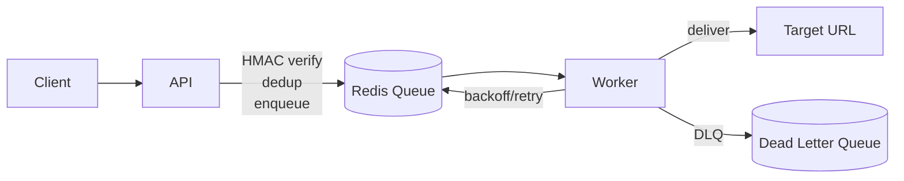

# Webhook Delivery Service

[](https://github.com/vanshch/webhook-delivery-service/actions/workflows/ci.yml)
[](https://python.org)
[](LICENSE)

A production-ready webhook delivery service with HMAC signature verification, idempotency-based deduplication, exponential backoff retries, and a dead-letter queue for failed deliveries.

## Architecture



## Key Features

- **HMAC Signature Verification** — Timing-safe `hmac.compare_digest()` check on every incoming payload
- **Idempotency / Deduplication** — Redis-backed duplicate suppression with configurable TTL
- **Exponential Backoff with Jitter** — Automatic retry with `2^attempt + random jitter`, capped at 60s
- **Dead-Letter Queue** — Exhausted deliveries are moved to a DLQ for manual inspection
- **Concurrent Worker** — Async event loop with semaphore-bounded concurrency (50 concurrent deliveries)

## Performance Benchmarks

The service underwent significant optimizations (transitioning from a blocking architecture to async workers and a proper Redis setup), yielding massive improvements in both ingestion and delivery:

| Stage | Ingestion Throughput | Delivery Throughput | Avg Latency |
|-------|----------------------|---------------------|-------------|
| **Initial (Vanilla FastAPI, Blocking I/O)** | ~6.08 RPS | N/A | 1.77s |
| **Middle (Proper Redis + Sync Worker)** | ~58.76 RPS | ~5 RPS / worker | ~1.70s |
| **Final (Async I/O, Redis Caching & Async Workers)** | ~184.54 RPS | ~250+ RPS / worker | 52.23ms |

**Impact**: 30x increase in ingestion speed, 50x increase in delivery speed, and a 97% reduction in request latency.

## Tech Stack

| Component | Technology |
|-----------|-----------|
| API | FastAPI + Uvicorn |
| Validation | Pydantic v2 + pydantic-settings |
| Queue / State | Redis |
| Worker | Standalone async Python process |
| Container | Docker + Compose |

## Quick Start

### Docker (Recommended)

```bash
# 1. Clone the repository
git clone https://github.com/vanshch/webhook-delivery-service.git
cd webhook-delivery-service

# 2. Copy environment config
cp .env.example .env

# 3. Start all services
docker compose up --build
```

### Local Development

```bash
# 1. Create and activate virtual environment
python -m venv .venv
source .venv/bin/activate  # Linux/macOS
.venv\Scripts\activate     # Windows

# 2. Install dependencies
pip install -r requirements-dev.txt

# 3. Copy environment config
cp .env.example .env

# 4. Start Redis (required)
# via Docker:  docker run -d -p 6379:6379 redis:alpine
# via system:  redis-server

# 5. Start the API server
uvicorn app.main:app --reload --port 8000

# 6. Start the delivery worker (separate terminal)
python -m app.workers.delivery_worker
```

## Environment Variables

| Variable | Default | Description |
|----------|---------|-------------|
| `REDIS_URL` | `redis://localhost:6379/0` | Redis connection URL |
| `WEBHOOK_SECRET` | `""` | HMAC secret for verifying incoming webhooks |
| `OUTBOUND_WEBHOOK_SECRET` | `""` | HMAC secret for signing delivered webhooks |
| `MAX_RETRY_ATTEMPTS` | `5` | Max delivery attempts before moving to DLQ |
| `IDEMPOTENCY_TTL_SECONDS` | `86400` | How long (seconds) to remember processed webhook IDs |
| `PORT` | `8000` | API server port |
| `DEFAULT_TARGET_URL` | `http://httpbin.org/post` | Default delivery target if none specified |

## API Reference

### `GET /health`

Health check endpoint.

```json
{ "status": "ok" }
```

### `POST /webhooks`

Ingest a webhook event for delivery.

**Headers:**
- `Content-Type: application/json`
- `x-signature: sha256=<hmac-hex-digest>` — HMAC-SHA256 of the raw request body

**Request Body:**
```json
{
  "id": "unique-event-id",
  "event_type": "order.created",
  "payload": { "order_id": 42 },
  "target_url": "https://example.com/webhook"  // optional
}
```

**Responses:**
- `202 Accepted` — Webhook enqueued for delivery
- `200 OK` — Duplicate webhook (already processed)
- `401 Unauthorized` — Invalid HMAC signature
- `400 Bad Request` — Malformed JSON body

## Testing

```bash
# Install dev dependencies
pip install -r requirements-dev.txt

# Run all tests
pytest tests/

# Run with verbose output
pytest tests/ -v
```

## Project Structure

```
├── app/
│   ├── main.py              # FastAPI application + request logging middleware
│   ├── config.py             # Pydantic settings (env-based configuration)
│   ├── models.py             # Pydantic models (IncomingWebhook, DeliveryStatus)
│   ├── core/
│   │   ├── security.py       # HMAC signature verification
│   │   ├── idempotency.py    # Redis-backed deduplication
│   │   └── retry.py          # Exponential backoff + DLQ logic
│   ├── routes/
│   │   ├── health.py         # GET /health
│   │   └── webhooks.py       # POST /webhooks
│   ├── storage/
│   │   └── redis_client.py   # Redis connection management
│   └── workers/
│       └── delivery_worker.py # Async delivery worker with retry loop
├── tests/                    # pytest test suite
├── scripts/                  # Utility scripts (test webhook sender, stress test)
├── Dockerfile
├── docker-compose.yml
└── requirements.txt
```

## License

This project is licensed under the MIT License — see the [LICENSE](LICENSE) file for details.
