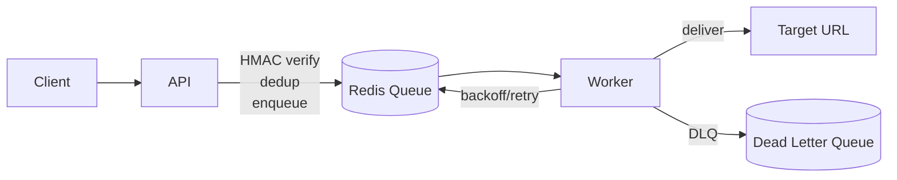

# Webhook Delivery Service

> **Note:** The original commit history for this project was accidentally lost during local development. This repository represents the consolidated initial release, and all future iterative updates will be tracked from here forward.

A production-ready webhook delivery service with retry, exponential backoff, and idempotency.

**🔗 Live demo: TBD (To Be Deployed)**

## Architecture



## The Hard Problems
- **HMAC Verification**: Timing-safe signature check on incoming payloads
- **Idempotency/Dedup**: Redis-backed duplicate suppression with TTL
- **Exponential Backoff**: Dynamic delay calculation for retries
- **Dead-Letter Queue**: Handling exhaustively failed deliveries

## Local Setup
1. Copy `.env.example` to `.env`: `cp .env.example .env`
2. Start the services: `docker compose up --build`
3. Send a test webhook:
   ```bash
   curl -X POST http://localhost:8000/webhooks \
        -H "Content-Type: application/json" \
        -H "x-signature: <dummy>" \
        -d '{"id": "123", "event_type": "test", "payload": {}}'
   ```

## Tech Stack & Layout
- **API**: FastAPI + Uvicorn
- **Validation**: Pydantic v2 + pydantic-settings
- **Queue/State**: Redis (local dev), managed (e.g. Upstash) for prod
- **Worker**: Standalone Python process
- **Container**: Docker + Compose
